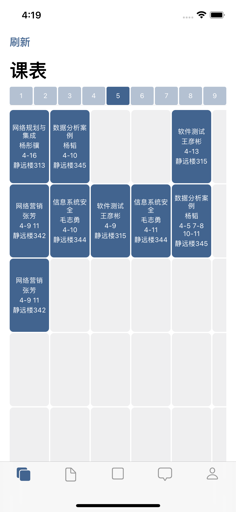
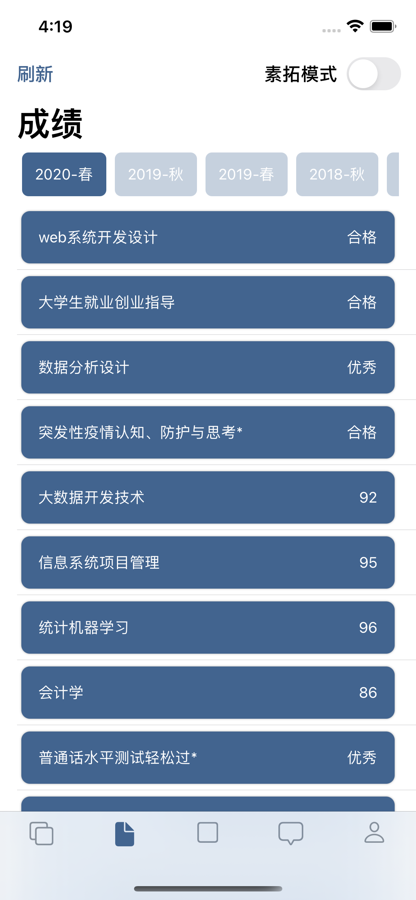
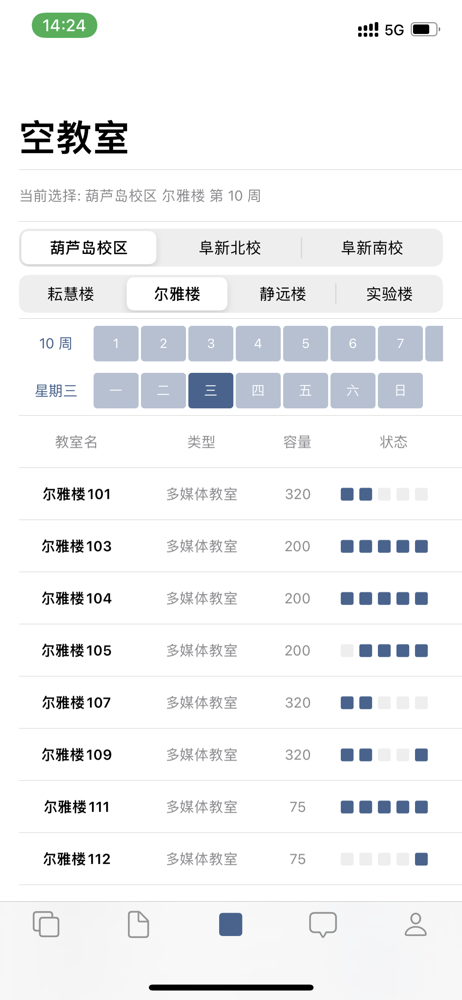
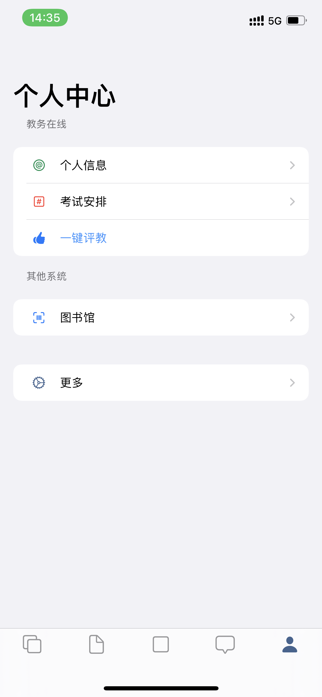

# LNTUHelper-iOS

**This project had been archived, thanks for all the friends that following and supporting it ever.**

An iOS App(Demo) for Liaoning Technical University LNTU.

You cloud compile and pair it to develop or use with [LNTU-API.](https://github.com/LiaoGuoYin/LNTU-API)

# Requirements

Xcode 11+

iPadOS 13+ / iOS 13+

# Screenshots

